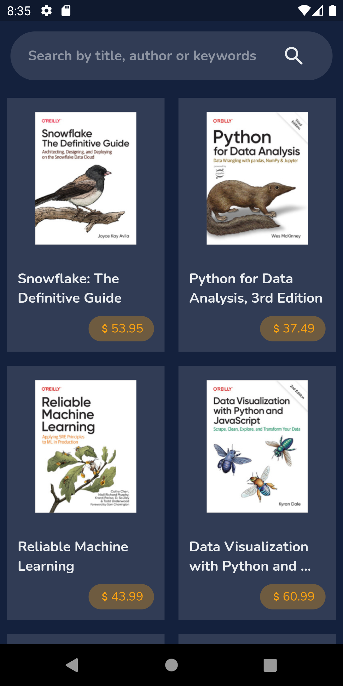
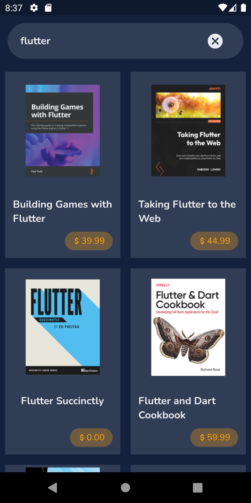

# IT Book Store

Welcome to our Flutter app that brings the latest and greatest tech books directly to your fingertips. Utilizing the ITBook API, I have created a seamless experience for you to browse, search, and even save your favorite books for later. So whether you're a seasoned programmer or just starting out, this app has got you covered.

## Screenshots

Here is a screenshot of the app:

<p float="left">



</p>

## Getting Started

To run this app, you will need the Flutter SDK.

1. [Install Flutter](https://flutter.dev/docs/get-started/install)
2. Clone this repository
<!-- 3. Download [Font(s)](https://fonts.google.com/) in (copy the `.ttf` of variable weight):
```yaml
fonts:
    - family: Playball
      fonts:
        - asset: assets/fonts/Playball-Regular.ttf
``` -->
3. Navigate to the project directory in your terminal
4. Run `flutter run` to start the app

## Dependencies

```yaml
dependencies:
  flutter:
    sdk: flutter
  cupertino_icons: ^1.0.2
  google_fonts: ^3.0.1
  flutter_bloc: ^8.1.1
  equatable: ^2.0.5
```


## Credits

- [Flutter](https://flutter.dev)
- [Dart](https://dart.dev)
- [ITBook API](https://api.itbook.store/)
